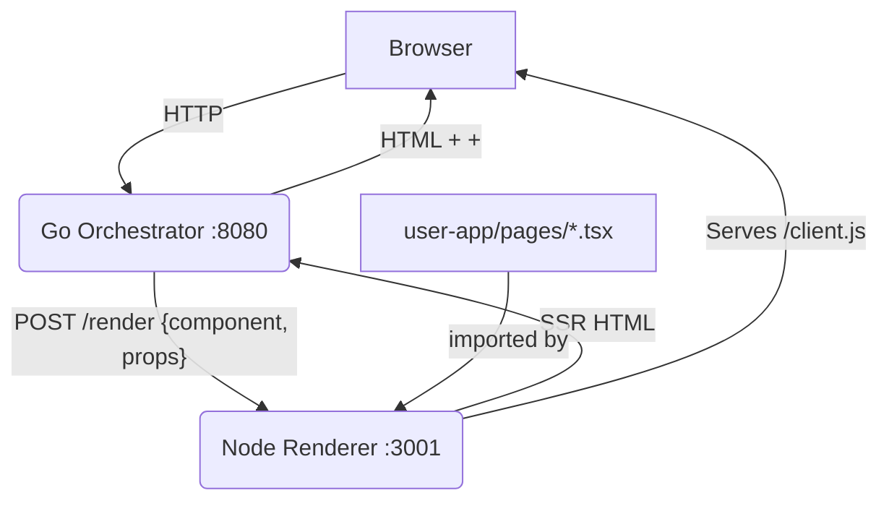

# Go React Meta-Framework

## 1. What is this project? (Goals)

This is a proof-of-concept meta-framework for building high-performance, server-side rendered (SSR) React applications using a Go backend as the orchestrator and a Node.js process for React SSR. The goal is to:
- Provide a modern SSR React stack with Go as the public-facing server.
- Hide all build and hydration complexity from the user—users only write React components in `user-app/pages`.
- Enable fast development and production workflows with a single command for each.
- Allow for future extensibility (e.g., HMR, data fetching, etc.).

---

## 2. Architecture Diagram



---

## 3. Getting Started

### Prerequisites
- [Go](https://golang.org/) (v1.20+)
- [Node.js](https://nodejs.org/) (v18+ recommended)
- [pnpm](https://pnpm.io/) (v8+ recommended)

### Install dependencies and build everything
```bash
pnpm install
```

### Development mode (auto-rebuild, live reload)
```bash
pnpm dev
```
- Starts both the Go orchestrator and Node renderer (with client bundle watcher).
- Edit files in `user-app/pages/` and refresh the browser to see changes and interactivity.

### Production build
```bash
pnpm build
```
- Builds the Go binary and the static client bundle.

### Production run
```bash
pnpm start
```
- Runs both the Go orchestrator and Node renderer using the production builds.

### Visit your app
Open [http://localhost:8080](http://localhost:8080) in your browser.

---

## 4. Current Limitations
- **No true HMR (Hot Module Replacement):** The client bundle is rebuilt and you must refresh the browser to see changes.
- **No dynamic routing:** Only file-based routing from `user-app/pages` is supported.
- **No data fetching conventions:** Props are static in the orchestrator; no API/data layer yet.
- **No error overlays or dev tools.**
- **No code splitting or asset optimization.**
- **No authentication/session support.**
- **No TypeScript type-checking in the build pipeline.**
- **No tests or CI/CD pipeline yet.**

---

## 5. How to Contribute

1. **Fork this repo and clone your fork.**
2. **Create a new branch for your feature or fix.**
3. **Make your changes.**
    - For framework changes: edit files in `go-orchestrator/` or `node-renderer/`.
    - For user-facing app: edit files in `user-app/pages/`.
4. **Test your changes:**
    - Run `pnpm dev` and verify everything works as expected.
5. **Push your branch and open a pull request.**
6. **Describe your changes and why they're useful.**

---

## 6. Project Structure

```
my-go-framework/
├── bin/                  # Go binary output
├── go-orchestrator/      # Go server (public-facing)
├── node-renderer/        # Node.js SSR and hydration
├── user-app/             # User React app (just write pages here!)
│   └── pages/            # File-based routing
├── package.json          # Root scripts/workspaces
├── pnpm-workspace.yaml   # pnpm monorepo config
└── .gitignore
```

---

## 7. FAQ

**Q: Where do I write my app code?**
- Only in `user-app/pages/`. Everything else is handled for you.

**Q: How do I add a new page?**
- Add a new `.tsx` file to `user-app/pages/` (e.g., `about.tsx`). It will be routed as `/about`.

**Q: How do I pass props?**
- Edit the Go orchestrator to provide props for SSR and hydration.

**Q: How do I add dependencies?**
- Use `pnpm add <package> -F user-app` for user code, or `-F node-renderer` for framework code.

---

## 8. License

Mozilla Public License 2.0