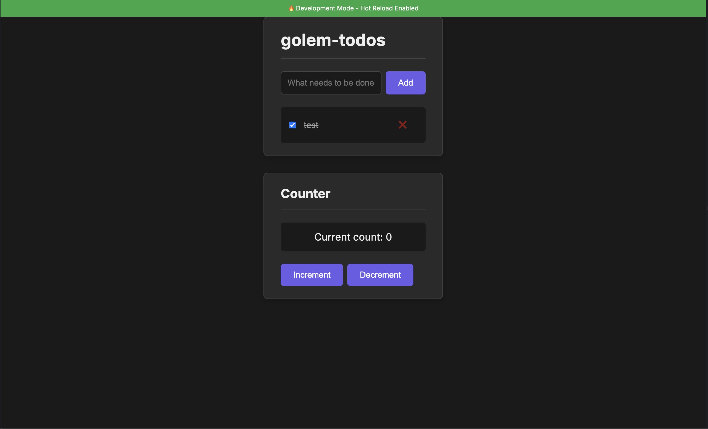
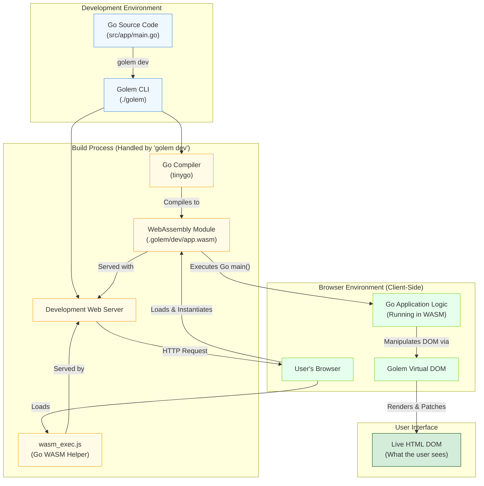
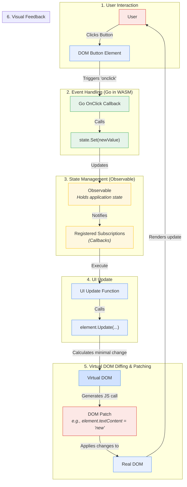

# Golem: A Go-Based Reactive Web Framework



# Golem Framework 🗿

[](https://goreportcard.com/report/github.com/Nu11ified/golem)
[](https://opensource.org/licenses/MIT)
[](#current-status)

**Build powerful, reactive, and type-safe web frontends with pure Go.**

Golem is an experimental web framework that leverages WebAssembly to allow developers to write frontend applications entirely in the Go programming language. It eliminates the need for a separate JavaScript/TypeScript toolchain and brings the benefits of Go's simplicity, performance, and type safety to the world of frontend development.

## Features

-   ✅ **Pure Go Frontend**: Write your UI components, state management, and application logic in 100% Go.
-   ✅ **Type Safety**: Catch errors at compile time, not runtime, with Go's static typing across your entire stack.
-   ✅ **Reactivity Model**: A simple and powerful observable-based state management system to build dynamic interfaces.
-   ✅ **Virtual DOM**: Efficiently updates the browser's DOM by calculating and applying minimal changes.
-   ✅ **CLI Tooling**: A simple `golem` command to create, run, and build your projects.
-   ✅ **Zero JS Dependencies**: The final build is a static `index.html`, a `wasm_exec.js` helper, and your compiled `app.wasm`.

## Architecture Deep Dive

Golem's architecture is designed to be simple and transparent. The following diagrams illustrate the key concepts.

### 1. System Architecture

This diagram shows the high-level view of the Golem ecosystem, from development to the final application running in the browser.



### 2. Reactivity & Data Flow

This diagram details how Golem's reactive state management works. When an event updates the application state, the UI automatically reflects the change through a one-way data flow.



## Quick Start

### Installation

#### Option 1: One-line Install (Recommended)
```bash
curl -sSL https://raw.githubusercontent.com/Nu11ified/golem/main/install.sh | bash
```

This script automatically detects your OS/architecture and installs the latest release.

#### Option 2: Manual Download
1. Go to the [releases page](https://github.com/Nu11ified/golem/releases)
2. Download the appropriate binary for your platform (auto-built for all platforms)
3. Extract the archive and move the binary to your PATH

#### Option 3: Build from Source
```bash
git clone https://github.com/Nu11ified/golem.git
cd golem
go build -o golem ./cmd/golem/main.go
```

### Create Your First App

```bash
# Create a new project
golem new my-golem-app

# Navigate to the project
cd my-golem-app

# Start the development server
golem dev
```

The server will start, compile your Go application to WebAssembly, and serve it. You can now access your application at `http://localhost:3000`.

## Getting Started

### 1. Installation

Choose one of the installation methods above to get the `golem` CLI tool.

### 2. Create a New Project

Use the CLI to create a new Golem application.

```bash
golem new my-golem-app
```

### 3. Run the Development Server

Navigate into your new project and start the development server.

```bash
cd my-golem-app
golem dev
```

The server will start, compile your Go application to WebAssembly, and serve it. You can now access your application at `http://localhost:3000`.

## Example Application

Here is a simplified version of a data-fetching application to demonstrate Golem's core concepts.

**File: `src/app/main.go`**

```go
package main

import (
	"fmt"
	"syscall/js"

	"github.com/Nu11ified/golem/dom"
	"github.com/Nu11ified/golem/state"
)

func App() *dom.Element {
	// 1. Define reactive state for the counter
	count := state.NewObservable(0)

	// 2. Create a text node that will display the count
	// We will update this element directly when the state changes.
	countText := dom.Text(fmt.Sprintf("Current count: %d", count.Get()))

	// 3. Subscribe to state changes
	// This function runs whenever count.Set() is called.
	count.Subscribe(func(newValue, _ int) {
		// Update the text node's content directly
		countText.Update(map[string]interface{}{
			"textContent": fmt.Sprintf("Current count: %d", newValue),
		})
	})

	// 4. Return the element tree
	return dom.Div(
		dom.H1("Golem Counter Example"),
		dom.P(countText), // Embed the reactive text node
		dom.Button(
			"Increment",
			dom.OnClick(func() {
				// Increment the state, which triggers the subscription
				count.Set(count.Get() + 1)
			}),
		),
		dom.Button(
			"Decrement",
			dom.OnClick(func() {
				count.Set(count.Get() - 1)
			}),
		),
	)
}

func main() {
	// Render the main App component into the DOM element with id="app"
	dom.Render(App(), "#app")

	// Prevent the Go program from exiting, which is necessary for WASM apps
	select {}
}
```

## CLI Commands

| Command         | Description                                                        |
| --------------- | ------------------------------------------------------------------ |
| `golem new <name>`  | Creates a new Golem project in a directory with the given name.    |
| `golem dev`         | Starts the development server, watches for file changes, and rebuilds. |
| `golem build`       | (Coming Soon) Bundles the application for production.              |
| `golem version`     | Prints the version of the Golem CLI.                               |

## 🚀 Automated Releases

This project uses automated releases! Binaries are automatically built for all platforms when code is pushed. 

**To trigger a new release**, use conventional commit messages:
```bash
# Bug fixes (patch version)
git commit -m "fix: resolve authentication issue"

# New features (minor version) 
git commit -m "feat: add dark mode support"

# Breaking changes (major version)
git commit -m "feat!: redesign API structure"
```

**Every commit to main** automatically builds and tests on all platforms. Release binaries include Linux (x64/ARM64), macOS (Intel/Apple Silicon), and Windows (x64).

## Current Status: Experimental

Golem is currently in a highly experimental, proof-of-concept stage. The API is subject to change. It is not yet ready for production use but is a great environment for experimenting with the future of web development in Go.

## Roadmap

-   [ ] **v0.2**: Stabilize the core `dom` and `state` APIs.
-   [ ] **v0.3**: Implement a robust component lifecycle system.
-   [ ] **v0.4**: Introduce a CSS-in-Go styling solution.
-   [ ] **v0.5**: Add a client-side router.
-   [ ] **v1.0**: Production-ready release.

## Contributing

This project is in its early stages, and contributions are highly welcome! Whether it's bug reports, feature suggestions, or code contributions, please feel free to open an issue or pull request.

Use conventional commit messages to trigger automatic releases when your changes are ready.

## License

This project is licensed under the MIT License - see the [LICENSE](LICENSE) file for details.