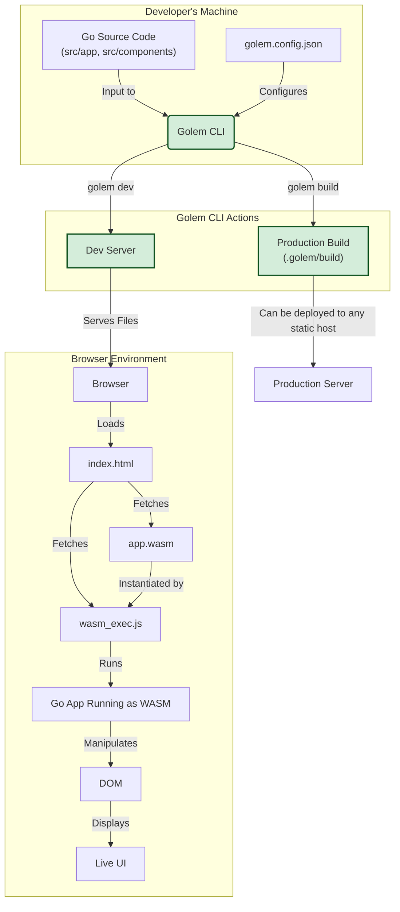

# Golem Framework 🗿

**Build powerful, reactive, and type-safe web applications with pure Go.**

Golem is an experimental framework that leverages WebAssembly to allow developers to write frontend applications entirely in Go. It provides a CLI for managing projects, a reactive state management system, and a component-based architecture for building user interfaces.

## Core Philosophy

-   **Go Everywhere**: Eliminate the need for a JavaScript/TypeScript toolchain for frontend development. Write in one language for your entire stack.
-   **Type Safety**: Leverage Go's static typing across your entire application, from server logic to frontend components, catching errors at compile time.
-   **Simplicity**: Provide a minimal, intuitive API that feels natural to Go developers, without sacrificing the power needed for modern web applications.
-   **Performance**: Utilize WebAssembly to run high-performance Go code directly in the browser.

## Architecture Diagram

The diagram below outlines the development lifecycle and architecture of a Golem application:



## Features

-   ✅ **Pure Go Frontend**: Write your entire application, including UI components and logic, in Go.
-   ✅ **CLI Tooling**: A simple `golem` command to create, run, and build your projects.
-   ✅ **Reactivity**: A state management system (`state` package) with observables to automatically update your UI when data changes.
-   ✅ **Component-Based UI**: A simple but powerful component model (`dom` package) for creating reusable UI elements.
-   ✅ **Efficient Rendering**: Uses a Virtual DOM to minimize direct manipulation of the browser's DOM.
-   ✅ **Zero JS Dependencies**: The final build is a static `index.html`, a `wasm_exec.js` helper, and your compiled `app.wasm`.

## Getting Started

### 1. Build the Golem CLI

First, build the command-line tool from the project root.

```bash
go build -o golem ./cmd/golem/main.go
```

### 2. Create a New Project

Use the newly built CLI to create a new Golem application.

```bash
./golem new my-golem-app
```

### 3. Run the Development Server

Navigate into your new project and start the development server.

```bash
cd my-golem-app
../golem dev
```

The server will start, compile your Go application to WebAssembly, and serve it. You can now access your application at `http://localhost:3000`.

## Project Structure

A new Golem project has the following structure:

-   `golem.config.json`: Project-specific configuration for the Golem CLI.
-   `go.mod`: The project's Go module file.
-   `src/`: Contains your application's source code.
    -   `app/main.go`: The main entry point for your application.
    -   `components/`: A place for your reusable UI components.
    -   `server/`: (Future Use) For server-side Go functions callable from the frontend.
-   `.golem/`: Contains build artifacts and other files generated by the framework. This directory should typically be added to `.gitignore`.

## Current Status

Golem is currently in a highly experimental, proof-of-concept stage. The API is subject to change, and many features (like true hot-reloading) are still under development.

Contributions and feedback are welcome!

## 🎯 Why Golem?

**The Problem**: Modern web development requires mastering multiple languages, toolchains, and paradigms. JavaScript/TypeScript for frontend, Go/Python/Node for backend, complex build tools, package managers, and maintaining type safety across the stack is challenging.

**The Golem Solution**: Write your entire web application in Go. The framework compiles your Go code to WebAssembly for the browser and provides a seamless development experience with full type safety.

## 🚀 Quick Start

### Installation

```bash
go install github.com/Nu11ified/golem/cmd/golem@latest
```

### Create New Project

```bash
golem new my-app
cd my-app
golem dev
```

Your app will be running at `http://localhost:3000` 🎉

## 📁 Project Structure

```
my-app/
├── .golem/
│   ├── build/     # Production builds
│   ├── dev/       # Development artifacts  
│   └── types/     # Generated type definitions
├── src/
│   ├── app/       # Main application code
│   │   └── main.golem
│   ├── components/    # Reusable UI components
│   │   └── Button.golem
│   └── server/    # Backend server functions
│       └── hello.go
├── golem.config.json
├── go.mod
└── package.json   # For development tools only
```

## 💻 Example Application

**Frontend (`src/app/main.golem`):**

```go
package main

import (
    "github.com/Nu11ified/golem/dom"
    "./components"
)

type AppState struct {
    Count int `json:"count"`
}

func (s *AppState) Increment() {
    s.Count++
}

func (s *AppState) Decrement() {
    s.Count--
}

func App() *dom.Element {
    state := &AppState{Count: 0}
    
    return dom.Div(
        dom.Class("app"),
        dom.H1("Welcome to Golem! 🚀"),
        
        dom.Div(
            dom.Class("counter"),
            dom.P("Count: ", dom.Text(state.Count)),
            
            dom.Button(
                dom.Text("Increment"),
                dom.OnClick(state.Increment),
            ),
            dom.Button(
                dom.Text("Decrement"), 
                dom.OnClick(state.Decrement),
            ),
        ),
        
        components.Button(components.ButtonProps{
            Text: "Call Server Function",
            OnClick: func() {
                // Type-safe server function call
                result := server.Hello("World")
                dom.Alert("Server says: " + result)
            },
        }),
    )
}

func main() {
    dom.Render(App(), "#app")
}
```

**Backend (`src/server/hello.go`):**

```go
package server

import "fmt"

// Hello is automatically exposed to the frontend
func Hello(name string) string {
    return fmt.Sprintf("Hello, %s! From Go server.", name)
}

// GetUser demonstrates typed server functions
func GetUser(userID int) (*User, error) {
    return &User{
        ID:   userID,
        Name: "John Doe",
        Email: "john@example.com",
    }, nil
}

type User struct {
    ID    int    `json:"id"`
    Name  string `json:"name"`
    Email string `json:"email"`
}
```

**Component (`src/components/Button.golem`):**

```go
package components

import "github.com/Nu11ified/golem/dom"

type ButtonProps struct {
    Text     string
    OnClick  func()
    Variant  string // "primary", "secondary", "danger"
    Disabled bool
}

func Button(props ButtonProps) *dom.Element {
    class := "btn"
    if props.Variant != "" {
        class += " btn-" + props.Variant
    }
    
    return dom.Button(
        dom.Class(class),
        dom.Text(props.Text),
        dom.OnClick(props.OnClick),
        dom.If(props.Disabled, dom.Disabled(true)),
    )
}
```

## 🛠 CLI Commands

```bash
# Development
golem dev          # Start development server with hot reload

# Production  
golem build        # Build optimized production bundle
golem start        # Start production server

# Project Management
golem new <name>   # Create new Golem project
golem version      # Show version information
```

## 🏗 How It Works

1. **Compile Time**: Golem analyzes your `.golem` files and generates:
   - WebAssembly binaries for frontend code
   - gRPC services for server functions  
   - Type definitions for IDE support

2. **Runtime**: 
   - Frontend runs as WebAssembly in the browser
   - Virtual DOM efficiently updates only changed elements
   - Server functions are called via gRPC with full type safety
   - State changes trigger automatic re-renders

3. **Development**: Hot reload watches your files and instantly updates the browser without losing state

## 🎨 Virtual DOM & State Management

Golem's virtual DOM is optimized for Go's strengths:

```go
// State automatically triggers re-renders when modified
type TodoState struct {
    Items []TodoItem `json:"items"`
}

func (s *TodoState) AddTodo(text string) {
    s.Items = append(s.Items, TodoItem{
        ID:   len(s.Items) + 1,
        Text: text,
        Done: false,
    })
    // Automatic re-render triggered
}

// Efficient rendering - only changed elements update
func (s *TodoState) Render() *dom.Element {
    return dom.Div(
        dom.Class("todo-app"),
        dom.For(s.Items, func(item TodoItem) *dom.Element {
            return dom.Li(
                dom.Class("todo-item"),
                dom.Text(item.Text),
                dom.If(item.Done, dom.Class("completed")),
            )
        }),
    )
}
```

## 🔧 Configuration

**`golem.config.json`:**

```json
{
  "projectName": "my-app",
  "entry": "src/app/main.golem",
  "output": ".golem/build",
  "dev": {
    "port": 3000,
    "hotReload": true,
    "watch": ["src/**/*.golem", "src/**/*.go"]
  },
  "server": {
    "grpc": {
      "port": 50051,
      "reflection": true
    },
    "functions": "src/server"
  },
  "wasm": {
    "optimizeSize": true,
    "enableFeatures": ["bulk-memory", "mutable-globals"]
  }
}
```

## 🚀 Performance 

- **Bundle Size**: Optimized WASM binaries (~500KB gzipped)
- **Runtime**: Near-native performance thanks to WebAssembly
- **Loading**: Progressive loading with instant hydration
- **Updates**: Minimal DOM operations via virtual DOM diffing

## 🛣 Roadmap

- [ ] **v0.2**: Complete gRPC integration
- [ ] **v0.3**: CSS-in-Go styling system  
- [ ] **v0.4**: Routing and navigation
- [ ] **v0.5**: Database integration patterns
- [ ] **v0.6**: Progressive Web App features
- [ ] **v1.0**: Production-ready release

## 🤝 Contributing

We welcome contributions! Please see our [Contributing Guide](CONTRIBUTING.md) for details.

## 📖 Documentation

- [Getting Started Guide](docs/getting-started.md)
- [API Reference](docs/api-reference.md)
- [Component Guide](docs/components.md)
- [Server Functions](docs/server-functions.md)
- [Examples](examples/)

## 📄 License

MIT License - see [LICENSE](LICENSE) file for details.

## ⭐ Support

If you find Golem useful, please consider giving it a star on GitHub! 

---

**Built with ❤️ by [@Nu11ified](https://github.com/Nu11ified)**

*Golem Framework - Reactive web apps, purely in Go.* 