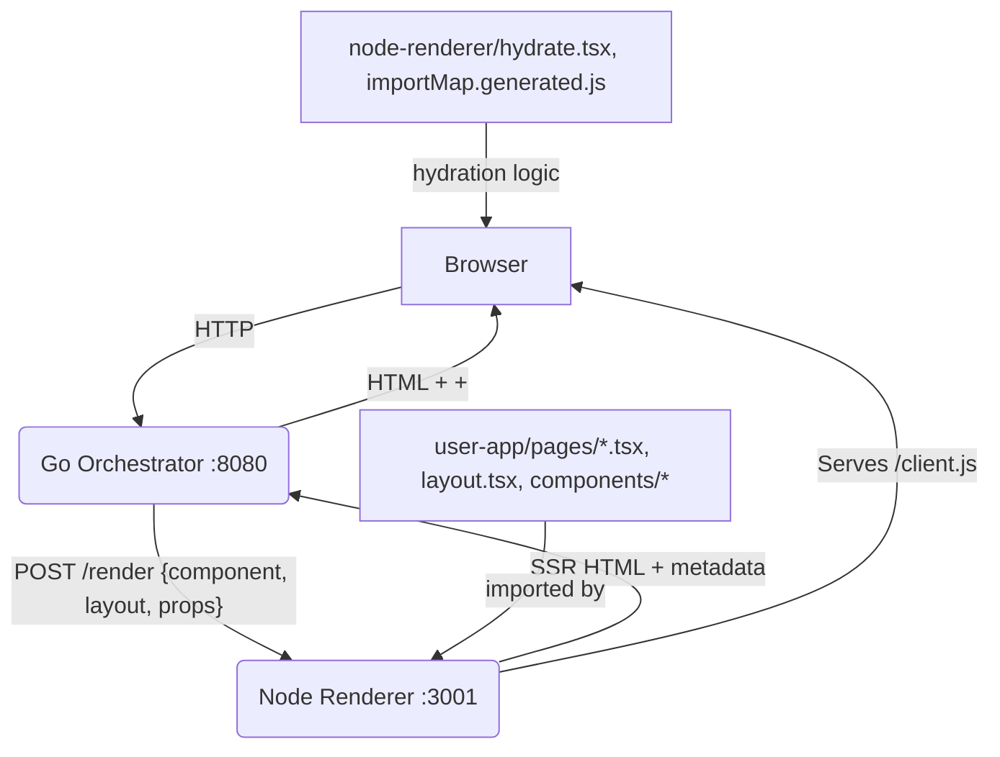

# Go React Meta-Framework

## 1. What is this project? (Goals)

This is a proof-of-concept meta-framework for building high-performance, server-side rendered (SSR) React applications using a Go backend as the orchestrator and a Node.js process for React SSR. The goal is to:
- Provide a modern SSR React stack with Go as the public-facing server.
- Hide all build and hydration complexity from the user—users only write React components, layouts, and static assets in `user-app/`.
- All SSR/hydration logic (including the hydration entry point and import map) lives in `node-renderer/` for clean separation.
- Enable fast development and production workflows with a single command for each.
- Support Next.js-style layouts, metadata/SEO, and file-based routing.
- Allow for future extensibility (e.g., HMR, data fetching, etc.).

---

## 2. Architecture Diagram



---

## 3. Getting Started

### Prerequisites
- [Go](https://golang.org/) (v1.20+)
- [Node.js](https://nodejs.org/) (v18+ recommended)
- [pnpm](https://pnpm.io/) (v8+ recommended)

### Install dependencies and build everything
```bash
pnpm install
```

### Development mode (auto-rebuild, live reload)
```bash
pnpm dev
```
- Starts both the Go orchestrator and Node renderer (with client bundle watcher).
- Edit files in `user-app/pages/`, `user-app/components/`, or `user-app/public/` and refresh the browser to see changes and interactivity.
- **Automatic import map generation:** All pages and layouts are auto-discovered for hydration.

### Production build
```bash
pnpm build
```
- Builds the Go binary and the static client bundle.

### Production run
```bash
pnpm start
```
- Runs both the Go orchestrator and Node renderer using the production builds.

### Visit your app
Open [http://localhost:8080](http://localhost:8080) in your browser.

---

## 4. Features

### 🗂️ File-Based Routing
- Any `.tsx` file in `user-app/pages/` becomes a route (including nested folders).
- Example: `pages/about.tsx` → `/about`, `pages/blog/post.tsx` → `/blog/post`.

### 🧩 Next.js-Style Layouts
- Add a `layout.tsx` in any folder in `pages/` to wrap all pages in that folder (and subfolders).
- Example: `pages/layout.tsx` is the global layout; `pages/blog/layout.tsx` wraps all `/blog/*` pages.
- Layouts receive `children` as a prop.

### 📝 Metadata & SEO
- Export a `metadata` object from any page or layout:
  ```tsx
  // pages/layout.tsx
  export const metadata = {
    title: 'My Custom Site',
    description: 'A modern Go/React meta-framework demo',
    favicon: '/favicon.ico',
  };
  ```
- Metadata is merged (layout takes precedence) and injected into the HTML `<head>` (title, description, favicon, etc.).

### ⚡ Automatic Import Map Generation
- All pages and layouts are auto-discovered and included in the client bundle for hydration.
- No need to manually update import maps—just add files to `pages/`.
- **All hydration logic and the import map now live in `node-renderer/` for separation of concerns.**

### 🖼️ Static Assets
- Place static files in `user-app/public/` (e.g., `favicon.ico`, images, etc.).
- Access them at `/filename.ext` (e.g., `/favicon.ico`).

### 🧩 Components
- Place reusable components in `user-app/components/` and import them into your pages/layouts.

---

## 5. Example: Layout, Metadata, and Component Usage

**user-app/pages/layout.tsx**
```tsx
import React from 'react';

export const metadata = {
  title: 'My Custom Site',
  description: 'A modern Go/React meta-framework demo',
  favicon: '/favicon.ico',
};

export default function RootLayout({ children }: { children: React.ReactNode }) {
  return (
    <div style={{ minHeight: '100vh', background: '#222', color: '#fff' }}>
      <header style={{ padding: '1rem', background: '#61dafb', color: '#222', fontWeight: 'bold', fontSize: '1.5rem' }}>
        🚀 My Custom Site
      </header>
      <main style={{ padding: '2rem' }}>{children}</main>
    </div>
  );
}
```

**user-app/components/InteractiveButton.tsx**
```tsx
import React, { useState } from 'react';

export default function InteractiveButton() {
  const [clicked, setClicked] = useState(false);
  return (
    <button
      style={{ marginTop: '2rem', padding: '0.5rem 1.5rem', fontSize: '1.1rem', borderRadius: '6px', border: 'none', background: '#61DAFB', color: '#222', cursor: 'pointer' }}
      onClick={() => setClicked(c => !c)}
    >
      {clicked ? 'You clicked me!' : 'Click me!'}
    </button>
  );
}
```

**user-app/pages/index.tsx**
```tsx
import React from 'react';
import InteractiveButton from '../components/InteractiveButton';

export default function HomePage({ frameworkName }: { frameworkName: string }) {
  return (
    <div style={{ fontFamily: 'sans-serif', padding: '2rem', border: '2px solid #61DAFB', borderRadius: '8px', maxWidth: '600px', margin: '2rem auto', textAlign: 'center' }}>
      <h1>Welcome to the Future!</h1>
      <p>This React component was server-side rendered by a <strong>{frameworkName}</strong> stack.</p>
      <InteractiveButton />
    </div>
  );
}
```

---

## 6. Current Limitations
- **No true HMR (Hot Module Replacement):** The client bundle is rebuilt and you must refresh the browser to see changes.
- **No dynamic data fetching conventions:** Props are static in the orchestrator; no API/data layer yet.
- **No error overlays or dev tools.**
- **No code splitting or asset optimization.**
- **No authentication/session support.**
- **No TypeScript type-checking in the build pipeline.**
- **No tests or CI/CD pipeline yet.**

---

## 7. How to Contribute

1. **Fork this repo and clone your fork.**
2. **Create a new branch for your feature or fix.**
3. **Make your changes.**
    - For framework changes: edit files in `go-orchestrator/` or `node-renderer/`.
    - For user-facing app: edit files in `user-app/pages/`, `user-app/components/`, or `user-app/public/`.
4. **Test your changes:**
    - Run `pnpm dev` and verify everything works as expected.
5. **Push your branch and open a pull request.**
6. **Describe your changes and why they're useful.**

---

## 8. Project Structure

```
my-go-framework/
├── bin/                  # Go binary output
├── go-orchestrator/      # Go server (public-facing)
├── node-renderer/        # Node.js SSR, hydration, and all build logic
│   ├── hydrate.tsx       # Hydration entry point (internal)
│   ├── importMap.generated.js # Auto-generated import map (internal)
│   └── ...               # Other SSR/build scripts
├── user-app/             # User React app (just write pages, components, and static assets!)
│   ├── pages/            # File-based routing & layouts
│   ├── components/       # Reusable React components
│   └── public/           # Static assets (favicon, images, etc.)
├── package.json          # Root scripts/workspaces
├── pnpm-workspace.yaml   # pnpm monorepo config
└── .gitignore
```

---

## 9. FAQ

**Q: Where do I write my app code?**
- Only in `user-app/pages/`, `user-app/components/`, or `user-app/public/`. Everything else is handled for you.

**Q: How do I add a new page?**
- Add a new `.tsx` file to `user-app/pages/` (e.g., `about.tsx`). It will be routed as `/about`.

**Q: How do I add a layout?**
- Add a `layout.tsx` file to any folder in `pages/`.

**Q: How do I add metadata/SEO?**
- Export a `metadata` object from your page or layout.

**Q: How do I add static assets?**
- Place them in `user-app/public/` and reference them by URL (e.g., `/logo.png`).

**Q: How do I add reusable components?**
- Place them in `user-app/components/` and import them into your pages/layouts.

**Q: How do I add dependencies?**
- Use `pnpm add <package> -F user-app` for user code, or `-F node-renderer` for framework code.

---

## 10. License

Mozilla Public License 2.0