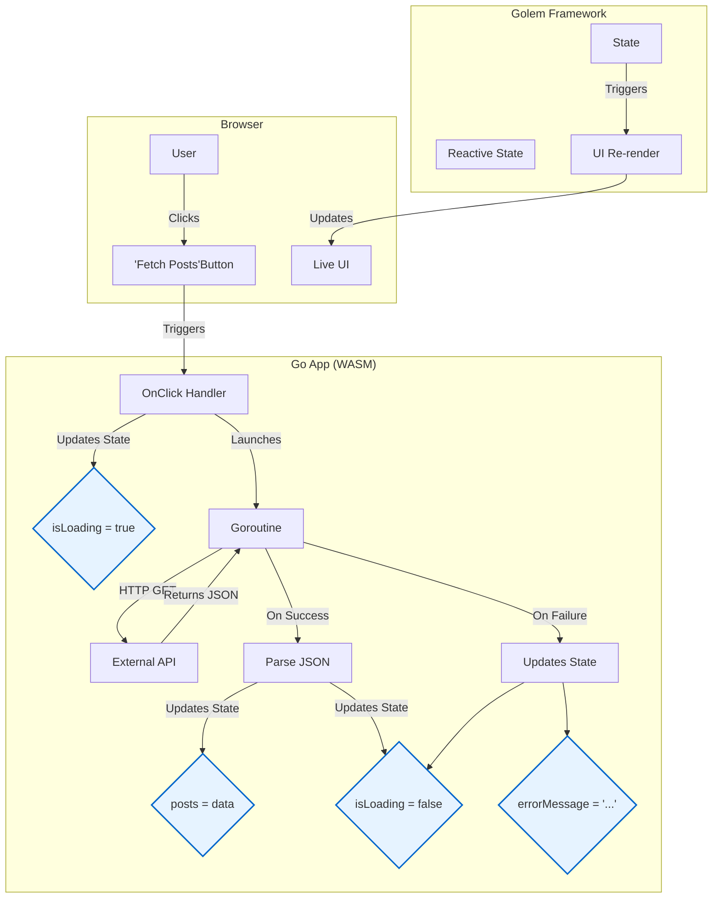

# Golem Framework - Post Fetcher Demo

This application is a real-world demonstration of the Golem framework's capabilities. It fetches a list of posts from a public JSON API and displays them in a list, handling loading and error states gracefully.

This demo showcases how to build dynamic, data-driven web applications in pure Go, compiled to WebAssembly.

## Architecture Diagram

The following diagram illustrates the flow of data and events in the application:



## Key Features Demonstrated

-   **Go to WebAssembly Compilation**: The entire application logic is written in Go and runs in the browser.
-   **Reactive State Management**: Uses `state.NewObservable` to create reactive state variables. The UI automatically updates when these variables change.
-   **Asynchronous Operations**: Fetches data from a remote API using a `goroutine` to prevent blocking the main UI thread.
-   **Component-Based UI**: The UI is structured as a tree of `dom` elements.
-   **Conditional Rendering**: Shows and hides a loading indicator and error messages based on the application's state.
-   **Dynamic List Rendering**: Dynamically creates a list of UI elements from the fetched API data.

## How to Run

1.  **Prerequisites**: Ensure you have Go (version 1.21 or newer) installed and the `golem` CLI has been built in the project root.
2.  **Navigate to the app**:
    ```bash
    cd golem-test-app
    ```
3.  **Start the dev server**:
    ```bash
    ../golem dev
    ```
4.  **Open in browser**: Navigate to `http://localhost:3000`.

## Code Overview

All the application logic resides in `src/app/main.go`.

-   **`App()` function**: This is the root component of the application. It initializes the state, defines the UI structure, and sets up the reactive subscriptions.
-   **State (`posts`, `isLoading`, `errorMessage`)**: These `state.Observable` variables hold the application's data. Any change to these variables will trigger the subscribed functions.
-   **Subscriptions (`.Subscribe(...)`)**: These functions link the application's state to the UI. For example, when the `posts` observable is updated with data from the API, its subscription function fires, clearing the old list and rendering the new posts.
-   **Data Fetching**: The `OnClick` handler for the "Fetch Posts" button launches a goroutine to perform the `http.Get` request. This ensures the UI remains responsive. The result of the API call (or any error) is used to update the state observables, which in turn updates the UI.
-   **`main()` function**: This function renders the `App` component into the DOM and uses `select {}` to keep the Go program alive, allowing it to handle user interactions indefinitely.
